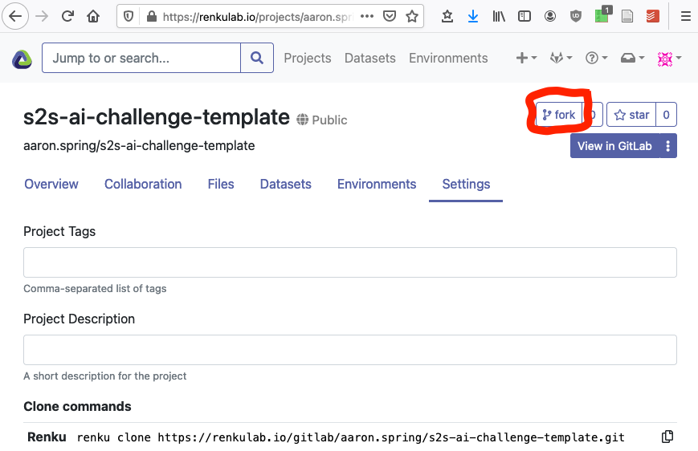

# S2S AI Challenge Template

This is a template repository with running examples how to join and contribute to
the s2s-ai-challenge. You were likely refered here from https://s2s-ai-challenge.github.io/.

## Introduction

This is a Renku project - basically a git repository with some
bells and whistles. You'll find we have already created some
useful things like `data` and `notebooks` directories and
a `Dockerfile`.

## Join the challenge

1. The simplest way to join the S2S AI Challenge is forking this renku project.
(Ensure you do not fork the gitlab repository, but the reku project).

Fork this template renku project from https://renkulab.io/projects/aaron.spring/s2s-ai-challenge-template/settings.

2. Make the project private (so that other people do not steal your idea/code)
3. Add the `scorer` user to your repo with Reporter permissions (this is the lowest view-only permission so that the scorer can check results)
4. Add a gitlab variable with key `COMPETITION` and name `S2S-AI` (we can set whatever name we want here)

## Contribute

The simplest way to contribute is right from the Renku platform - 
just click on the `Environments` tab in your renku project and start a new session.
This will start an interactive environment right in your browser.

To work with the project anywhere outside the Renku platform,
click the `Settings` tab where you will find the
git repo URLs - use `git` to clone the project on whichever machine you want.

5. Train your Machine Learning model, using training data from https://github.com/ecmwf-lab/climetlab-s2s-ai-challenge or renku datasets
6. Let the Machine Learning model perform subseasonal 2020 predictions as netcdf files
7. Commit training notebook/pipeline and ML_prediction.nc with `git lfs`. 
8. The `scorer` will fetch your predictions, score them with RPSS against recalibrated ECMWF real-time forecasts and add your score to the leaderboard at https://s2s-ai-challenge.github.io.

## Changing interactive environment dependencies

Initially we install a very minimal set of packages to keep the images small.
However, you can add python and conda packages in `requirements.txt` and
`environment.yml` to your heart's content. If you need more fine-grained
control over your environment, please see [the documentation](https://renku.readthedocs.io/en/latest/user/advanced_interfaces.html#dockerfile-modifications).

