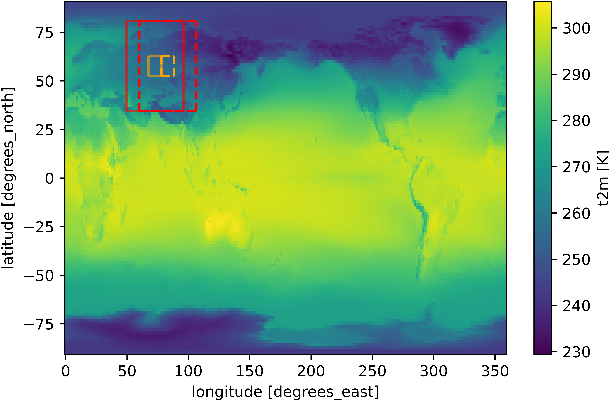
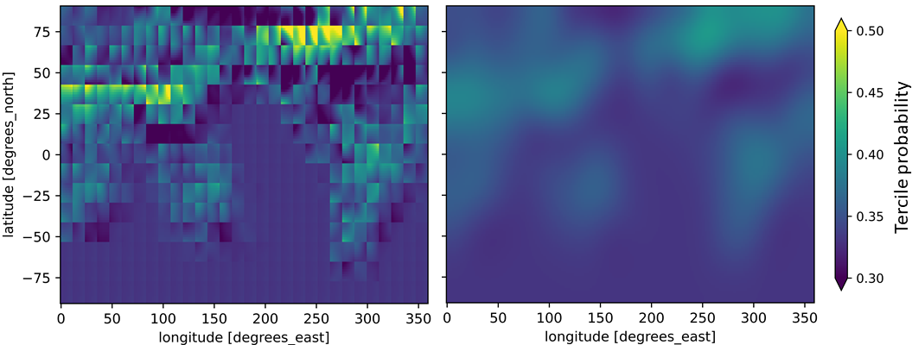

# S2S AI Challenge

This is the repository of the team KIT-ETH-UBERN for
the `s2s-ai-challenge`.

## Description of our method: local convolutional neural network

Our approach is based on a simplified version of a convolutional neural network architecture that was proposed for ensemble post-processing in Scheuerer et al. (2020). Spatial probabilistic forecasts are obtained by estimating coefficient values for local, spatially smooth basis functions. 

We trained one model for each variable and lead time, i.e., 4 models in total. 
Each model is trained on a limited domain over Eastern Europe (of approximately 50° x 50°). The model predicts tercile probabilities for the 64 grid cells at the center of the input domain jointly. To obtain a global prediction, we slide this local convolutional neural network over the whole globe (using a stride of 8 grid cells in latitude and longitude direction).

|
| 
|:--:| 
| Fig. 1:  Shown are two prediction steps. The red frame marks the input, the orange the output domain of a single prediction. The left input and output domain was used for training and hyperparameter optimization.|

Our local convolutional neural network is a simple post-processing / calibration model in the sense that it only uses S2S forecasts of the corresponding target variables as input. The two-channel input is derived by subtracting the weekly tercile edges (from _hindcast-like-observations_2000-2019_biweekly_tercile-edges.nc_) from the ensemble mean of the S2S target-variable forecast. These two-dimensional fields are standardized by division with the temporally averaged standard deviation over the input domain (similar to image pre-processing, where the standardization is done image-wise).  All missing values are filled with zeros. We used the terciled observations in _hindcast-like-observations_2000-2019_biweekly_terciled.zarr_ as labels for our training. 

A key component to the promising performance of our local CNN is label smoothing. Label smoothing is a regularization technique (Szegedy et al., 2016), that was found to prevent networks from becoming over-confident (Müller et al., 2019), and to improve model robustness for data with noisy labels (Lukasik et al., 2020). During hyperparameter optimization, we found that label smoothing is a powerful tool to regulate the sharpness of the predictions. We applied a smoothing coefficient of 0.6, which corresponds to replacing a hard target [0, 1, 0] by a soft target [0.2, 0.6, 0.2]. 

The model architecture is adapted from Scheuerer et al. (2020). The model consists of 
-	a convolutional layer with 4 filters of size 3 x 3 and ELU activation
-	a 2 x 2 max pooling layer

The output of the max pooling layer is flattened and dropout (dropout rate = 0.4) is applied. The resulting vector is run through
-	a dense layer with 10 nodes and ELU activation
-	a dense layer with 27 nodes (27 = 3 terciles * 9 basis functions) and ELU activation

The resulting vector is reshaped into a 3 x 9 matrix. The nine entries per tercile are now mapped to the 8 x 8 output domain by multiplying with a set of 9 basis functions (64 x 9 matrix). The basis functions are smooth functions with circular bounded support that are uniformly distributed over the output domain. As a last step, we apply a soft max activation function.

Our implementation builds on Keras. We minimize the categorical cross-entropy with label smoothing equal to 0.6 using the Adam optimizer with a learning rate of 0.0001, and stop the training after 20 epochs. 

For the hyperparameter optimization, we focused on parameters related to the size of input and output domain, namely input domain size, output domain size, radius of the basis functions and label smoothing. The optimization was done only for the model for t2m and lead time 3-4 weeks on the training domain over Eastern Europe. We performed a 10-fold cross-validation using 18 years as training set and two consecutive years as validation set.

The training of the final models was done on the same domain but using all 20 years from 2000 to 2019. One model was trained for each variable and lead time. 

The final submission is the average of an ensemble of 5 predictions per variable and lead time, obtained by repeating model estimation with different seeds. Each prediction was smoothed using gaussian filtering.  

|
|
|:--:| 
| Fig. 2:  Raw prediction for one tercile (left panel). Its smoothed counterpart with sigma = 9 in latitude and longitude direction (right panel).|

Our local convolutional neural network is a promising calibration method that is able to issue skilful predictions based on target-variable S2S forecasts only. We are looking forward to explore the potential of this method further by adding S2S forecasts of other variables and developing more sophisticated strategies to exploit the available data.

## Repository structure

All code is in the folder _notebooks_:
-	main_train_predict.ipynb: summarizes the training and prediction pipeline and contains safeguards ticks and details on reproducibility
-	CNN_train_predict.py: creates separate predictions for each lead time and variable for 5 different seeds
-	helper_ml_data.py: contains functions used for optimization and training

## Contributors

Submission team lead and main contributor: 
-	Nina Horat nina.horat@kit.edu

Additional contributors (alphabetical order):
-	Sebastian Lerch sebastian.lerch@kit.edu
-	Julian Quinting julian.quinting@kit.edu
-	Daniel Steinfeld daniel.steinfeld@giub.unibe.ch
-	Pavel Zwerschke pavel.zwerschke@student.kit.edu

We are very thankful for the discussion with (alphabetical order):
-	Mubashshir Ali mubashshir.ali@giub.unibe.ch
-	Roman Attinger roman.attinger@env.ethz.ch
-	Dominik Büeler dominik.bueeler@kit.edu
-	Jieyu Chen jieyu.chen@kit.edu
-	Christian Grams grams@kit.edu
-	Siddharth Kumar Gururani siddfisher@gmail.com
-	Selina Kiefer selina.kiefer@kit.edu
-	Nils Koster nils.koster@kit.edu
-	Michael Maier-Gerber michael.maier-gerber@kit.edu
-	Noelia Otero noelia.otero@giub.unibe.ch
-	Benedikt Schulz benedikt.schulz2@kit.edu

## References
Scheuerer, M., Switanek, M. B., Worsnop, R. P., and Hamill, T. M. (2020). Using Artificial Neural Networks for Generating Probabilistic Subseasonal Precipitation Forecasts over California, Monthly Weather Review, 148(8), 3489-3506. https://journals.ametsoc.org/view/journals/mwre/148/8/mwrD200096.xml

Szegedy, C., Vanhoucke, V., Ioffe, S., Shlens, J., and Wojna, Z. (2016). Rethinking the inception
architecture for computer vision. In Proceedings of the IEEE conference on computer vision and pattern recognition, 2818–2826. https://ieeexplore.ieee.org/stamp/stamp.jsp?tp=&arnumber=7780677  

Müller, R., Kornblith, S., and Hinton, G. (2019): When Does Label Smoothing Help? In Advances in Neural Information Processing Systems 32: Annual Conference on Neural Information Processing Systems 2019, 4696–4705. https://proceedings.neurips.cc/paper/2019/file/f1748d6b0fd9d439f71450117eba2725-Paper.pdf

Lukasik, M., Bhojanapalli, S., Menon, A. K., and Kumar, S. (2020). Does Label Smoothing Mitigate Label Noise? In Proceedings of the 37th International Conference on Machine
Learning, PMLR 119. http://proceedings.mlr.press/v119/lukasik20a/lukasik20a.pdf
