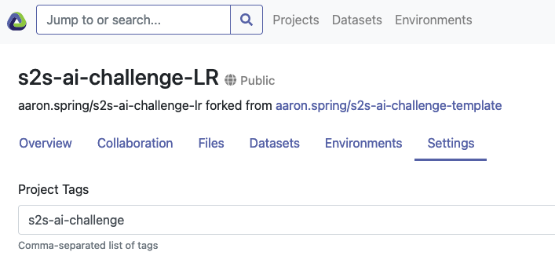

# S2S AI Challenge Template

This is a template repository with running examples how to join and contribute to
the `s2s-ai-challenge`.

You were likely referred here from the [public website](https://s2s-ai-challenge.github.io/).
Find an overview of [repositories and websites](https://renkulab.io/gitlab/aaron.spring/s2s-ai-challenge/-/wikis/Flow-of-information:-Where-do-I-find-what%3F)

If you have already forked this project before June 1st 2021, please fork again or pull recent changes.

## Introduction

This is a Renku project. Renku is a platform for reproducible and collaborative data analysis.
At its simplest a Renku project is a gitlab repository with added functionality.
So you can use this project just as a gitlab repository if you wish. However, you may be surprised
by what Renku has to offer and if you are curious the best place to start is the
[Renku documentation](https://renku.readthedocs.io/en/latest/).
You'll find we have already created some useful things like `data` and `notebooks` directories and
a `Dockerfile`.

## Join the challenge

### 1. The simplest way to join the S2S AI Challenge is forking this renku project.
Ensure you fork the renku project and the underlying gitlab repository through the renkulab.io page.

Fork this template renku project from https://renkulab.io/projects/aaron.spring/s2s-ai-challenge-template/settings.


Name your fork `s2s-ai-challenge-$TEAMNAME`.

Please add the project/repository tag `s2s-ai-challenge`, which is needed for the `scorer` bot to find your repo.
Under "Settings" in the renku project, please add `s2s-ai-challenge`:




When cloning this repository and you do not want to immediately download the `git lfs`-backed [renku datasets](https://renku.readthedocs.io/projects/renku-python/en/v0.4.0/cli.html#module-renku.cli.dataset), please use:
```bash
GIT_LFS_SKIP_SMUDGE=1 renku/git clone https://renkulab.io/projects/$YOURNAME/s2s-ai-challenge-$TEAMNAME
```

To be able to pull future changes from the [template](https://renkulab.io/gitlab/aaron.spring/s2s-ai-challenge-template) into your repository, add an `upstream`:

```bash
# in your fork locally
git remote add upstream git@gitlab.com:aaron.spring/s2s-ai-challenge-template.git
git pull upstream master
```

Major changes will be also announced on the [challenge website](https://s2s-ai-challenge.github.io/#announcements). The template will have release tags.


### 2. Fill our [registration form](https://docs.google.com/forms/d/1KEnATjaLOtV-o4N8PLinPXYnpba7egKsCCH_efriCb4).

Registrations are not required before October 31st 2021, but highly [appreciated for the flow of information](https://renkulab.io/gitlab/aaron.spring/s2s-ai-challenge/-/issues/4).

### 3. Make the project private

Now navigate to the gitlab page by clicking on "View in gitlab" in the upper right corner.
Under "Settings" - "General" - "Visibility" you can set your project private.


Now other people cannot steal your idea/code.

Please modify the `README` in your fork with your team's details and a
description of your method.


### 4. Add the `scorer` user to your repo with Reporter permissions
The scorer follows the code shown in the [verification notebook](https://renkulab.io/gitlab/aaron.spring/s2s-ai-challenge-template/-/blob/master/notebooks/verification_RPSS.ipynb). The scorer's username on gitlab is `s2saichallengescorer`. You should add it to your project with `Reporter` permissions. Under "Members" - "Invite Members" - "GitLab member or Email address", add `s2saichallengescorer`. The scorer will only ever clone your repository and evaluate your submission. It will never make any changes to your code.

## Make Predictions

### 5. Start jupyter on renku or locally
The simplest way to contribute is right from the Renku platform - 
just click on the `Environments` tab in your renku project and start a new session.
This will start an interactive environment right in your browser.


If the docker image fails initially, please re-build docker or touch the `enviroment.yml` file.

To work with the project anywhere outside the Renku platform,
click the `Settings` tab where you will find the
renku project URLs - use `renku clone` to clone the project on whichever machine you want.
Install [renku first with `pipx`](https://renku-python.readthedocs.io/en/latest/installation.html),
and then `renku clone https://renkulab.io/gitlab/$YOURNAME/s2s-ai-challenge-$GROUPNAME.git`

### 6. Train your Machine Learning model

Get training data via 
- [climetlab](https://github.com/ecmwf-lab/climetlab-s2s-ai-challenge)
- [renku datasets](https://renku.readthedocs.io/en/stable/user/data.html)

Get corresponding observations/ground truth:
- [climetlab](https://github.com/ecmwf-lab/climetlab-s2s-ai-challenge)
- IRIDL: [temperature](http://iridl.ldeo.columbia.edu/SOURCES/.NOAA/.NCEP/.CPC/.temperature/.daily/) and accumulated [precipitation](http://iridl.ldeo.columbia.edu/SOURCES/.NOAA/.NCEP/.CPC/.UNIFIED_PRCP/.GAUGE_BASED/.GLOBAL/.v1p0/.extREALTIME/.rain)

### 7. Let the Machine Learning model perform subseasonal 2020 predictions
and save them as `netcdf` files.
The submissions have to placed in the `submissions` folder with filename `ML_prediction_2020.nc`,
see [example](https://renkulab.io/gitlab/aaron.spring/s2s-ai-competition-bootstrap/-/blob/master/submissions/ML_prediction_2020.nc).

### 9. `git commit` training pipeline and netcdf submission
For later verification by the organizers, reproducibility and scoring of submissions,
commit the training notebook/pipeline and submission file 
`submissions/ML_prediction_2020.nc` with `git lfs`.
After committing, `git tag submission-method_name-number`. The automated scorer will
evaulate any tag (regardless of which branch it is on) that starts with the word `submission`
followed by any other combination of characters. In other words, any tags that satisfy the
regex `^submission.*` will be evaluated by the scorer. In addition, the scorer will only look for the
results in a file named `ML_prediction_2020.nc` located in the `submissions` folder
at the root of each competitor's repository.

Here is an example of a set of commands that would commit the results and add the scorer tag.
```bash
# run your training and create file ../submissions/ML_prediction_2020.nc
git lfs track "*.nc" # do once, already done in template
git add ../submissions/ML_prediction_2020.nc
git commit -m "commit submission for my_method_name" # whatever message you want
git tag "submission-my_method_name-0.0.1" # if this is to be checked by scorer, only the last submitted==tagged version will be considered
git push --tags
```

### 9. RPSS scoring by `scorer` bot
The `scorer` will fetch your tagged submissions, score them with RPSS against recalibrated ECMWF real-time forecasts.
Your score will be added to the private leaderboard, which will be made public in early November 2021.

The `scorer` is not active for the competition yet.

## More information

- in the [`s2s-ai-challenge` wiki](https://renkulab.io/gitlab/aaron.spring/s2s-ai-challenge/-/wikis/Home)
- all different resources for this [competition](https://renkulab.io/gitlab/aaron.spring/s2s-ai-challenge/-/wikis/Flow-of-information:-Where-do-I-find-what%3F)

## Changing interactive environment dependencies

Initially we install a very minimal set of packages to keep the images small.
However, you can add python and conda packages in `requirements.txt` and
`environment.yml` to your heart's content. If you need more fine-grained
control over your environment, please see [the documentation](https://renku.readthedocs.io/en/latest/user/advanced_interfaces.html#dockerfile-modifications).

