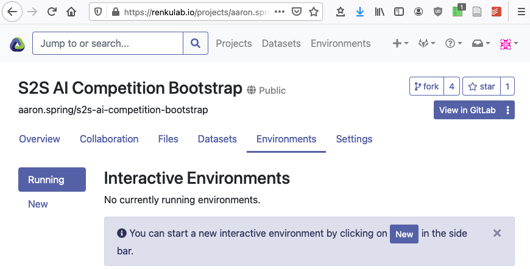

# S2S AI Challenge Template

This is a template repository with running examples how to join and contribute to
the `s2s-ai-challenge`.

You were likely referred here from the [public website](https://s2s-ai-challenge.github.io/).

The competition starts in June, so examples are still work in progress
and joining the competition not possible until then, but you can already look around.
If you fork this project before June, please rebase or fork again in June.

Find an overview of [repositories and websites](https://renkulab.io/gitlab/aaron.spring/s2s-ai-challenge/-/wikis/Flow-of-information:-Where-do-I-find-what%3F)

## Introduction

This is a Renku project - basically a git repository with some
bells and whistles. You'll find we have already created some
useful things like `data` and `notebooks` directories and
a `Dockerfile`.

## Join the challenge

### 1. The simplest way to join the S2S AI Challenge is forking this renku project.
Ensure you do not fork the gitlab repository, but the renku project.

Fork this template renku project from https://renkulab.io/projects/aaron.spring/s2s-ai-challenge-template/settings.


Name your fork `s2s-ai-challenge-$TEAMNAME`.

### 2. Fill our [registration form](https://docs.google.com/forms/d/1KEnATjaLOtV-o4N8PLinPXYnpba7egKsCCH_efriCb4).

### 3. Make the project private

Now check out the gitlab repository by clicking on "View in gitlab".
Under "Settings" - "General" - "Visibility" you can set your project private.


Now other people cannot steal your idea/code.

Now please modify the README in your fork with team details and a
description of your method.

### 4. Add the `scorer` user to your repo with Reporter permissions
The scorer is not yet ready, but will follow this [verification notebook](https://renkulab.io/gitlab/aaron.spring/s2s-ai-competition-bootstrap/-/blob/master/notebooks/verification_RPSS.ipynb).

### 5. Add a gitlab variable with key `COMPETITION` and name `S2S-AI`
In the gitlab repository, under "Settings" -> "CI/CD" -> "Variables", add the
`COMPETITION` key with value `S2S-AI`, so the `scorer` bot knows where to search
for submissions.


## Contribute

### 6. Start jupyter on renku or locally
The simplest way to contribute is right from the Renku platform - 
just click on the `Environments` tab in your renku project and start a new session.
This will start an interactive environment right in your browser.



If the docker image fails initially, please re-build docker or touch the `enviroment.yml` file.

To work with the project anywhere outside the Renku platform,
click the `Settings` tab where you will find the
renku project URLs - use `renku clone` to clone the project on whichever machine you want.
Install [renku first with `pipx`](https://renku-python.readthedocs.io/en/latest/installation.html),
and then `renku clone https://renkulab.io/gitlab/$YOURNAME/s2s-ai-challenge-$GROUPNAME.git`

### 7. Train your Machine Learning model

Get training data via 
- [climetlab](https://github.com/ecmwf-lab/climetlab-s2s-ai-challenge)
- [renku datasets](https://renku.readthedocs.io/en/stable/user/data.html)

Get corresponding observations/ground truth:
- [climetlab](https://github.com/ecmwf-lab/climetlab-s2s-ai-challenge)
- IRIDL: [temperature](http://iridl.ldeo.columbia.edu/SOURCES/.NOAA/.NCEP/.CPC/.temperature/.daily/) and accumulated [precipitation](http://iridl.ldeo.columbia.edu/SOURCES/.NOAA/.NCEP/.CPC/.UNIFIED_PRCP/.GAUGE_BASED/.GLOBAL/.v1p0/.extREALTIME/.rain)

### 8. Let the Machine Learning model perform subseasonal 2020 predictions
and save them as `netcdf` files.
The submissions have to placed in the `submissions` folder with filename `submission_your_choice.nc`,
see [example](https://renkulab.io/gitlab/aaron.spring/s2s-ai-competition-bootstrap/-/blob/master/submissions/submission_rb_prediction_2020.nc).

### 9. `git commit` training pipeline and netcdf submission
For later verification of the organizers, reproducibility and scoring of submissions,
the training notebook/pipeline and submission file ML_prediction.nc with `git lfs`.
After commiting, `git tag submission-method_name-number`
```bash
git lfs track "*.nc" # once, already done in template
git add submissions/submission_my_method.nc
git commit -m "commit submission for my_method"
git tag "submission-my_method-0.0.1" # if this is to be checked by scorer
git push --tags
```

### 10. RPSS scoring by `scorer` bot
The `scorer` will fetch your tagged submissions, score them with RPSS against recalibrated ECMWF real-time forecasts.
Your score will be added to the [leaderboard](https://s2s-ai-challenge.github.io/#leaderboard).

The `scorer` is not active for the competition yet.

## More information
in the [wiki](https://renkulab.io/gitlab/aaron.spring/s2s-ai-challenge-template/-/wikis/Home)

## Changing interactive environment dependencies

Initially we install a very minimal set of packages to keep the images small.
However, you can add python and conda packages in `requirements.txt` and
`environment.yml` to your heart's content. If you need more fine-grained
control over your environment, please see [the documentation](https://renku.readthedocs.io/en/latest/user/advanced_interfaces.html#dockerfile-modifications).

